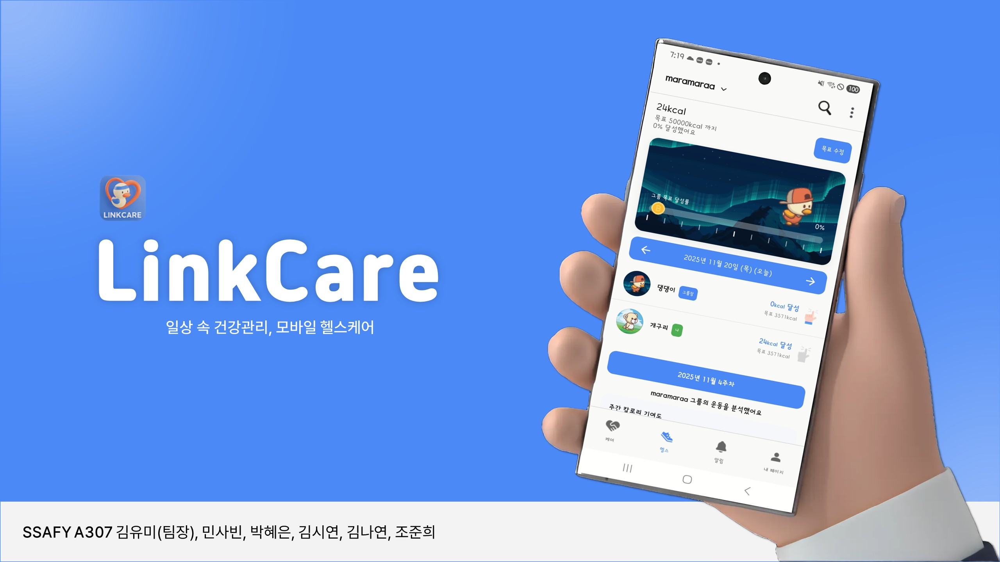
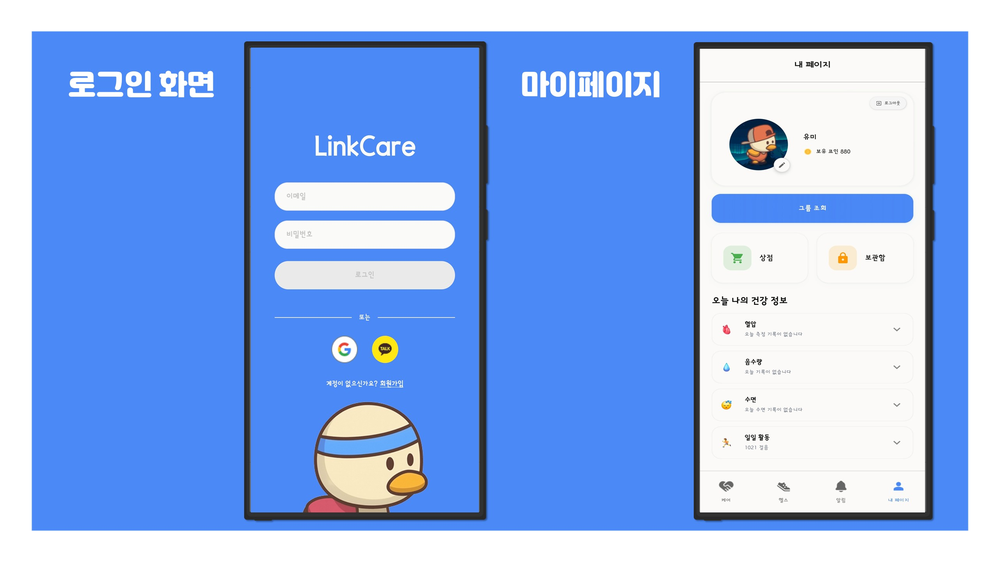
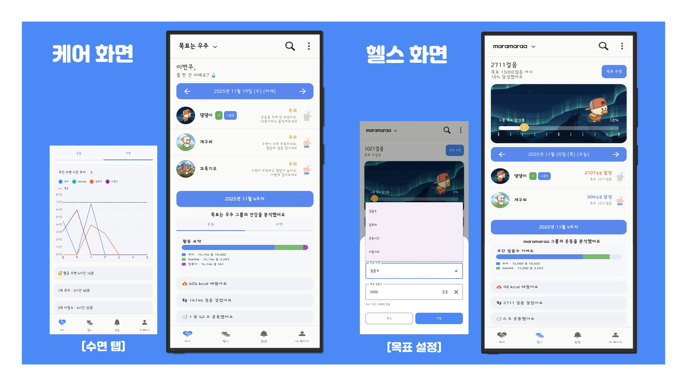
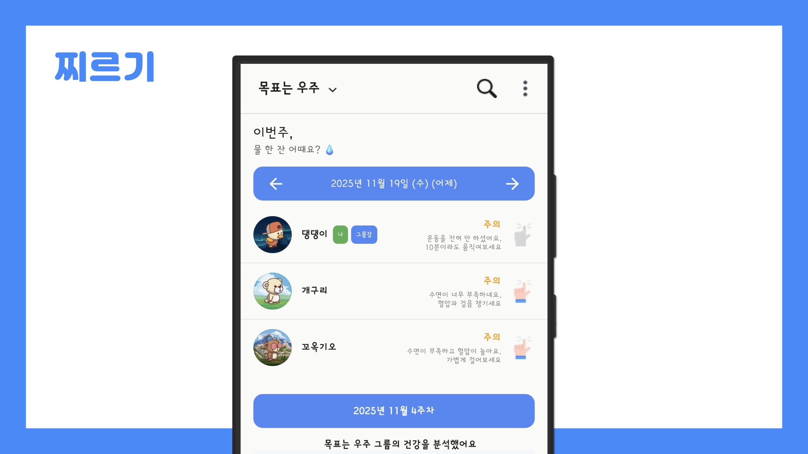
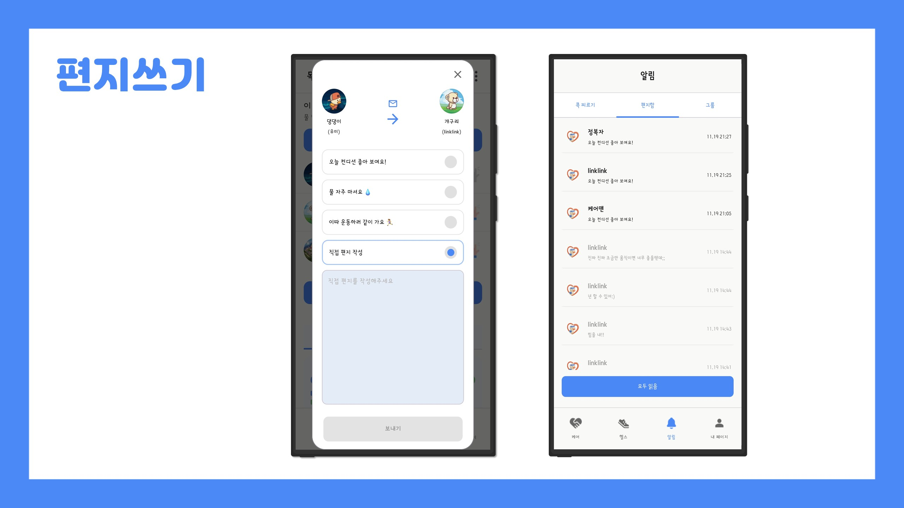

## Link Care (A307)
LinkCare – 일상 속 건강 관리, 모바일 헬스케어

## 1️⃣ 프로젝트 개요

### 개발 기간
| 일정 | 기간 |
|-------|------|
| 개발 기간 | 2025.10.10 ~ 2024.11.20 (6주) |

### 팀원 소개
| 이름 | 역할 |
|------|------|
| 김유미 | 팀장, Android (FE) |
| 민사빈 | Backend, Infra |
| 박혜은 | Backend |
| 김시연 | Backend |
| 김나연 | Wear OS |
| 조준희 | AI |

---

## 🎯 기획 배경
- 함께 운동하는 문화 (러닝크루 / 헬스모임) **빠르게 확산**
- **헬스케어 시장 연평균 성장률 18.8% (PWC 자료)**
- 사용자 니즈 조사 결과, 단순 기록이 아닌 **서로 챙기고 동기부여하는 구조 필요**

### 문제 정의
| 기존 헬스 앱 문제 |
|------------------|
| 개인 기록 중심 / 유지 어려움 |
| 데이터 해석 난이도 / 동기부여 약함 |
| 함께 운동하며 소통할 수 있는 기능 부재 |

### LinkCare가 해결하는 가치
- **건강 상태 시각화**
- **캐릭터 기반 직관적 피드백**
- **그룹 기반 공동 목표**
- **건강을 매개로 자연스러운 소통 제공**

---

## 2️⃣ 서비스 기능 소개

### 캐릭터를 통한 건강 데이터 시각화
- 걸음, 수면, 수분, 심박수에 따라 **표정·상태 변화**
- 건강 상황별 캐릭터 메시지 알림

### 그룹 기반 건강 관리 (CARE / HEALTH)
| 모드 | 설명 |
|-------|-------|
| **HEALTH** | 함께 운동하고 성장하는 공간 |
| **CARE** | 서로의 건강 상태를 케어하고 응원 |

### 실시간 소통
- 응원 메시지, 콕 찌르기, 그룹 알림
- FCM 실시간 푸시

### Wear OS + Mobile 연동
| 기능 | 설명 |
|-------|--------|
| Health Services | 실시간 센서 수집 |
| Data Layer | 워치 ↔ 모바일 안정 싱크 |
| BLE / Wi-Fi 자동 전환 | 연속성 보장 |

---

## 3️⃣ 주요 기능 화면

| 기능 | 설명 | 이미지 |
|------|------|-----------|
| **로그인 / 마이페이지** | 사용자 정보 확인 및 캐릭터 변경, 닉네임 수정 |  |
| **탭 전환 (HEALTH / CARE)** | 건강 데이터/케어 활동 간 전환 |  |
| **콕찌르기** | 빠르게 행동을 유도하는 즉각적 동기 자극 기능 |  |
| **편지쓰기, 알림** | 응원·격려·목표 공유 등 연결감 강화를 위한 깊은 소통 |  |

---

## 4️⃣ 기술 스택

| 영역 | 기술 |
|------|------|
| Mobile | Android, Kotlin, Jetpack Compose, Wear OS |
| Network | Retrofit / OkHttp / FCM |
| Backend | Spring Boot, JWT, JPA, Scheduler, Server-AI |
| Infra | AWS / Docker / Jenkins |
| AI | Gemma 최신 모델 기반 On-device AI |
| **ML** | LightGBM, RMSE 검증 기반 클리핑 (0.95~1.10) |
| Data | Samsung Health Services, Data Layer |

---

## 5️⃣ 아키텍처
📍 Wear OS
→ Health Services → Data Layer → Mobile AI Character Engine

📍 Mobile
→ On-device AI (Gemma 기반 lightweight reasoning)
→ REST API (Spring Boot)

📍 Backend
→ AI Goal Recommendation (LightGBM)
→ Stats Aggregation / History

📍 FCM
→ Group Notification / Real-time Motivation

---

## 6️⃣ 기대 효과
- 건강 데이터 이해도 향상
- 꾸준한 건강 관리 지속성 확보
- 실시간 동기부여 제공
- 웨어러블 생태계 활용 확대

---

## 7️⃣ 차별점
| 항목 | 차별점 |
|------|--------|
| 건강 시각화 | 심박/수면/걸음 기반 캐릭터 상태 변화 |
| 그룹 건강 관리 | 함께 목표 설정 + 실시간 응원/알림 |
| AI 기반 목표 추천 | LightGBM 기반 정책 데이터 학습 |
| **온디바이스 AI 적용** | **Gemma 기반 lightweight 모델로 앱 내 즉시 반응 생성** |
| 안정적인 데이터 수집 | BLE/Wifi 하이브리드 전환 + DataLayer |
| UX | 단순 데이터 공유가 아닌 감정 중심 캐릭터 UI |

> Gemma 관련 설명  
> - Google DeepMind의 오픈 모델이며 lightweight·온디바이스·멀티모달 확장 가능이 장점  
> - LinkCare는 앱 내 즉시 응답과 그룹 메시지 생성 등에 활용  
> - 모델의 빠른 응답성과 파라미터 경량화로 모바일 환경에 적합  